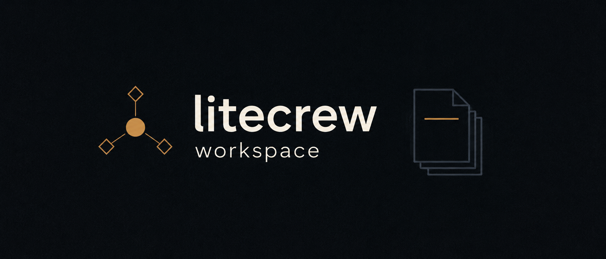
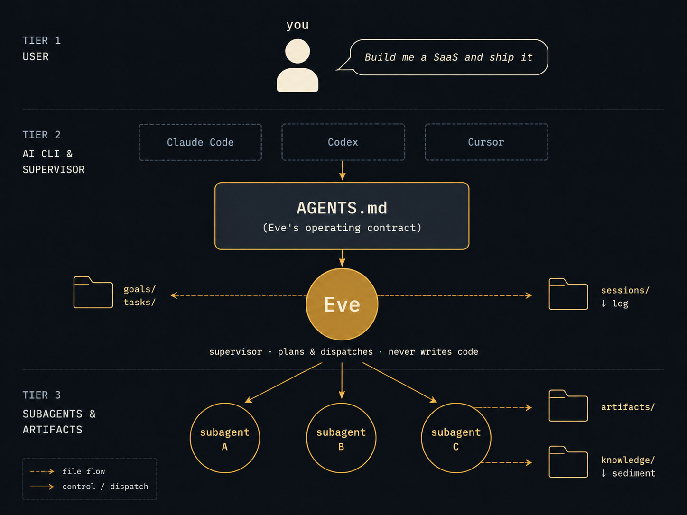
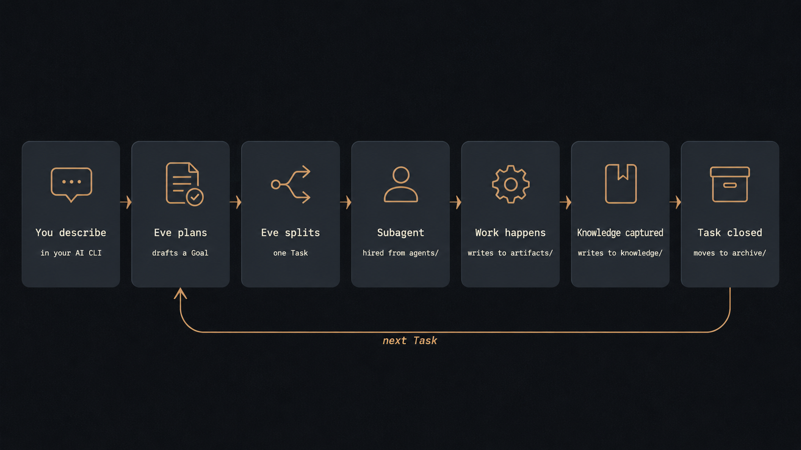

# litecrew-workspace
**All your AI work. One workspace.**



[](LICENSE) [](https://github.com/litecrew-ai/litecrew-workspace/stargazers) [](https://github.com/litecrew-ai/litecrew-workspace)

**The workspace for long-running AI work.** Build software, create videos,
research ideas, write documents, and run projects with AI — all in one
persistent workspace.

AI work is fragmented today. Claude Code and Cursor handle your software.
Veo handles your video. ChatGPT handles your research. Midjourney handles
your art. The work scatters across chats, repos, and screenshots — and every
session starts from zero.

`litecrew-workspace` brings it all together. It's a self-hosted directory of
plain-Markdown conventions: Eve (a supervisor agent) routes each piece of work
to the right specialist subagent, knowledge persists as files, and that
knowledge auto-loads when relevant — so the workspace becomes continuous,
not session-bound. No SaaS, no cloud, no telemetry.

## Quick start

```bash
git clone https://github.com/litecrew-ai/litecrew-workspace.git my-workspace
cd my-workspace

# Open this directory in your AI CLI of choice.
claude         # Claude Code
# codex        # Codex
# cursor .     # Cursor
```

Then describe what you want in plain language. For example:

> *"Build me a SaaS landing page and ship it to Vercel."*

Eve reads `AGENTS.md`, drafts a Goal capturing the outcome, splits off the first
Task, dispatches a subagent, and writes progress into the workspace as it goes.
You can interrupt, redirect, or ask for status at any time. When the Task closes,
Eve captures any reusable lessons and reports back.

**Zero install. Zero dependencies. Zero database.** Just Markdown and git.

## What can this do

If you can describe the work in one sentence, Eve can run it. A few real shapes:

| You say something like… | Eve turns it into |
|---|---|
| **Software development** — *"Build a SaaS dashboard and ship it."* | A Goal with success criteria, Tasks for [schema / API / UI / auth / deploy], frontend + backend subagents hired from `agents/`, CI walked, lessons captured. |
| **AI video / short-film production** — *"Produce a 60-second AI short from this script."* | A pipeline Goal: storyboard → first-frame → image-to-video → voiceover → stitch → publish. Each stage is a Task; each engine choice becomes a knowledge note. |
| **Hot-project research & benchmarking** — *"Research projects X and Y, find our gap."* | A research subagent dispatched, repos read, comparison tables written, conclusions sediment to `knowledge/` for the next time you ask. |
| **Hardware / PCB design** — *"Design an e-ink photo frame, ready for fabrication."* | Component selection → schematic → PCB layout → Gerber + BOM + pick-and-place, all under `artifacts/`. |
| **Game development** — *"Build a side-scroller RPG prototype."* | GDD → art direction → MVP. Three-role pattern (planner → art director → engineer) runs from `agents/`. |
| **Quant / market briefings** — *"Produce a daily morning briefing from RSS + social."* | Data-source ingestion → LLM summarization → schema-bound output. Repeatable across CLI restarts. |
| **Social media content ops** — *"Run my Twitter account, 3 posts a week."* | Persona benchmark → content calendar → draft → ship. Patterns sediment into a handbook. |
| **Long-form writing** — *"Write a 5,000-word essay on topic X."* | Research → outline → draft → revise. Knowledge captured for the next essay on adjacent topics. |
| **Personal knowledge base** — *"Track everything I learn about X."* | Notes accumulate across sessions, INDEX files stay coherent, stale notes get flagged for review. |

These are not features — they're **shapes the paradigm takes** when you describe work
in plain language. The same workspace can hold all of them at once, or just one.

## How it works

Three roles, four file types, one loop.



**You** talk to your AI CLI the way you always do. **Eve** is the supervisor that
emerges when the CLI reads `AGENTS.md` — she plans but never writes code herself.
**Subagents** are specialist workers hired from `agents/` for one Task at a time.
The **files** under `goals/`, `tasks/`, `knowledge/`, `artifacts/`, `sessions/`, and
`archive/` are the contract between them — and the durable trace they leave behind.

A single request moves through the workspace like this:



Every stage writes to disk before it returns. That's why nothing gets lost between
sessions — the workspace state *is* the file system.

## What makes it different

| | |
|---|---|
| **One workspace, many domains** | Software, video, research, writing, ops — Eve routes each piece of work to the right specialist subagent. No more context-switching across five tools. |
| **Knowledge auto-loads at session start** | When you describe new work, Eve pulls relevant lessons from past Tasks. The workspace becomes continuous, not session-bound. |
| **Goals are first-class** | Multi-week projects have a real shape: success criteria, task chains, progress log. Not just session history. |
| **Everything is plain Markdown** | Goals, Tasks, Knowledge, Sessions — `grep`, `git diff`, `bat` all work. No database to back up. |
| **Empty by design** | Ships with the paradigm, no opinions about your domain. Software, research, writing, hardware — same skeleton. |
| **CLI-agnostic, model-agnostic, zero lock-in** | Works with Claude Code, Codex, Cursor, opencode. Today Claude, tomorrow GPT-6. If litecrew vanishes, you keep a clean directory of Markdown. |

## What it is NOT

- **NOT a new CLI.** You don't install anything. Your existing Claude Code / Codex is the runtime.
- **NOT a SaaS.** No sign-up, no cloud, no telemetry. Files stay on your disk.
- **NOT an agent framework.** No Python SDK, no LangGraph-style graphs, no API to learn.
- **NOT a note-taking app for humans.** Obsidian is for you to read. litecrew is for the AI to read **and** write.
- **NOT domain-specific.** We're not Cursor for code, not Midjourney for art, not Veo for video. We're the workspace that orchestrates them all.

## What ships in the box

```
litecrew-workspace/
├── AGENTS.md            # Eve's operating contract (auto-loaded by your AI CLI)
├── workflows/           # Lifecycle protocols Eve follows (Goal, Task, Subagent, Knowledge, …)
├── templates/           # File templates Eve instantiates when creating new Goals / Tasks / agents
├── agents/              # Subagent definitions. Ships with one example (workspace-archivist).
├── skills/              # Two meta-skills: find-skills + skill-creator
├── docs/assets/         # README images (not used by Eve)
├── goals/               # Empty — Eve fills this in as you describe what you want
├── tasks/               # Empty — same
├── knowledge/           # Empty — durable lessons captured across Tasks
├── handbooks/           # Empty — domain playbooks Eve writes when patterns repeat
├── sessions/            # Empty — Eve's session log for cross-conversation memory
└── archive/             # Empty — closed Goals and Tasks retire here
```

Every directory ships with a README explaining its role. The empty directories are
intentional: **you bring the work, Eve brings the discipline**.

## Proven in real workloads

This paradigm was battle-tested for months in the maintainers' private workspace
across many domains in parallel — software, hardware design, AI video, game
development, research, content automation. The Markdown contracts held up across
all of them. What you see here is the distillation: every workflow, every template,
every protocol earned its place by carrying weight in real work. All domain-specific
content has been stripped so you start clean.

## Which AI CLIs work with this

- **Claude Code**: reads `CLAUDE.md` automatically. This repo symlinks `CLAUDE.md` →
  `AGENTS.md`, so Eve's contract loads with zero configuration.
- **Codex / Cursor / opencode / others**: most modern AI CLIs auto-load `AGENTS.md` or
  an equivalent project-level file. If yours doesn't, open `AGENTS.md` in your first
  message and the rest of the conversation will follow the same paradigm.

## License

MIT — see [`LICENSE`](./LICENSE). © litecrew contributors.
