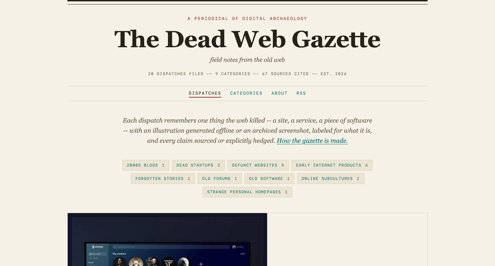

# litecrew-workspace-showcase

**A real [litecrew-workspace](https://github.com/litecrew-ai/litecrew-workspace)
instance, driven through real agent sessions, published as a lived-in exhibit.**

This repository is not a template and not a demo script. It started as the unmodified
`litecrew-workspace` skeleton (tagged `baseline`) and then grew exclusively through
real work: a human user made requests, the workspace's supervisor agent (Eve) framed
Goals and dispatched Tasks, specialist subagents executed them, and every decision,
failure, and lesson was written into the files you can read here. The git history is
the product being exhibited.

## The case: an internet archaeology blog

The showcase's flagship case is **The Dead Web Gazette** -- a blog that scours the
internet for the dead and the forgotten (defunct websites, dead startups, old
software, 2000s web culture) and generates an illustrated, sourced memorial post for
each subject, in a register like: *"In 2004, someone built a website. That website
once had 3 million users. Today, no one remembers it."*

**Preview the site: <https://litecrew.ai/cases/internet-archaeology/>**



Built and operated entirely through the workspace, across six Tasks and one hired
specialist agent:

- a Python-stdlib-only pipeline (`artifacts/writing/internet-archaeology-blog/`) that
  discovers subjects from keyless public APIs, distills cited fact sheets, drafts
  posts, illustrates them, and assembles a static site -- one command, deterministic
  rebuilds, a 475-check verifier;
- 20 published posts spanning all nine subject categories, each with provenance
  (sources, data-source mode, illustration origin) rendered on the page;
- real historical images acquired via search-engine routes with strict subject
  matching and visible attribution;
- an honest failure trail: the three failed attempts to screenshot archived pages
  (a dead endpoint, a timeout mechanism, an environment-specific hang) are preserved
  in the history exactly as they happened, next to the diagnosis notes that closed
  them.

To run it locally:

```bash
cd artifacts/writing/internet-archaeology-blog
python3 run.py --rebuild-only   # build the static site from content/posts/
python3 run.py --verify         # full structural verification
# open site/index.html in any browser (file://-safe), or:
cd site && python3 -m http.server 8000
```

## What is litecrew-workspace?

A brief introduction -- the full story continues on the workspace's own page:

**[github.com/litecrew-ai/litecrew-workspace](https://github.com/litecrew-ai/litecrew-workspace)**

`litecrew-workspace` is the workspace for long-running AI work: a self-hosted
directory of plain-Markdown conventions in which a supervisor agent (**Eve**) plans
and routes every piece of work, specialist **subagents** execute it one Task at a
time, and the durable state -- Goals, Tasks, knowledge, session notes, artifacts --
lives as files that auto-load in later sessions. No SaaS, no database, no lock-in:
your existing AI CLI is the runtime, and if litecrew vanishes tomorrow you keep a
clean directory of Markdown.

Three roles, four file types, one loop: you describe the work; Eve reads the
workspace contract (`AGENTS.md`), frames a Goal with success criteria, splits off a
Task, and hires the right subagent; the subagent writes code/words/artifacts and
sediments reusable lessons into `knowledge/`; Eve reviews against the completion
criteria, closes the Task, and updates the Goal. Every stage writes to disk before
it returns -- which is why this exhibit can exist at all.

## Reading this repository

Suggested order for a first visit:

| Path | What you will find |
|---|---|
| `sessions/SUMMARY.md` | Rolling window of what happened, with links to per-session details |
| `sessions/2026-08-29-*.md` | The activation notes -- the narrative spine of the exhibit |
| `goals/` | The active operations Goal (the build Goal completed and lives in `archive/goals/`) |
| `archive/tasks/` | All six closed Task records: description, iteration rounds, conclusions |
| `agents/web-product-engineer.md` | The specialist hired by Eve to build and operate the gazette |
| `knowledge/writing/` | Sedimented lessons: source catalogs, pipeline recipes, failure traps |
| `artifacts/writing/internet-archaeology-blog/` | The product itself: pipeline, posts, site, run log |
| `workflows/`, `templates/`, `handbooks/` | The workspace protocols Eve and the subagents follow |

## Honesty notes

Higher priority than the exhibit looking good:

- A human played the user; every request in the history is real. The steward (Eve)
  plans, dispatches, and reviews; subagents produce all the work. Eve performs no
  development work herself.
- One activation, one commit. Until 2026-08-29 10:04 UTC all commits were made by the
  human operator; from the "commit and push" request onward, commits are made by the
  steward agent at the operator's direct instruction -- each such operation is
  recorded in `sessions/`.
- Failed rounds, wrong diagnoses, and retries stay in the history exactly as they
  happened (see the screenshot saga across three Tasks, including one Eve diagnosis
  that code inspection disproved). No cosmetic re-runs, no tidying after the fact.
- Hand-written (non-agent) files are limited to this README, `PUBLICATION.md` (the
  operator's runbook), and `.gitignore`; this README was rewritten at the operator's
  instruction as the publication pass. Everything after the `baseline` tag is
  produced by the recorded sessions.

## License

MIT -- see [`LICENSE`](./LICENSE). © litecrew contributors.
